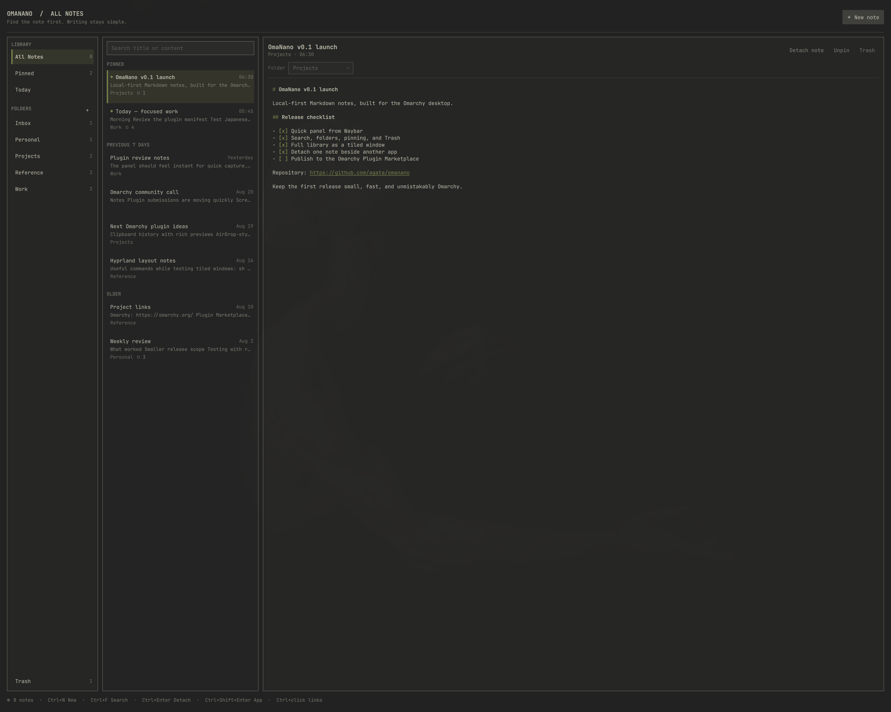
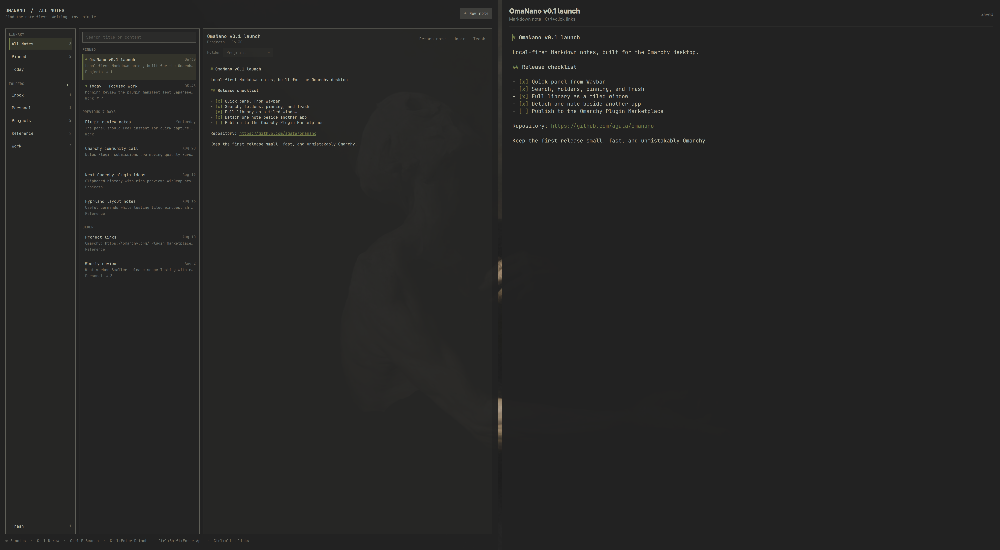

# OmaNano

**Your notes, one keystroke away.**

OmaNano is a local-first Markdown notes library designed for Omarchy. Capture a thought from Waybar, find it later in a calm three-pane library, or detach one note beside the work it belongs to.



## Three ways to stay in flow

- **Quick panel** — open OmaNano from Waybar for fast capture without rearranging your workspace.
- **Library window** — move the complete app into the Hyprland tiling layout when you want to browse, organize, and write for longer.
- **Detached note** — place one note beside a browser, terminal, editor, or call while the library remains available.



## What it can do

- Browse notes by recency, folder, pinned state, or Trash
- Search titles, folders, and note previews instantly
- Edit plain Markdown with subtle highlighting for headings, lists, tasks, code, and URLs
- Open links with `Ctrl+click`
- Create folders, pin important notes, trash notes, and restore them later
- Autosave safely with debounced, atomic writes
- Navigate by keyboard or mouse
- Follow the active Omarchy theme and accent color
- Keep all notes as ordinary files under `~/.local/share/omanano/notes/`

OmaNano makes no network requests and requires no account. Your notes stay on your machine in a format you can read with any text editor.

The library index contains metadata and short previews only. Note bodies are loaded on demand for the selected note, with a 1 MiB safety limit; larger files remain untouched and can still be opened with another editor. The visible library is capped at 2,000 notes and 2,000 folders to keep the long-lived Omarchy shell memory-bounded.

## Install

Install from the Omarchy Plugin Marketplace, or directly from GitHub:

```bash
omarchy plugin add https://github.com/agata/omanano --enable
```

If the widget is not already visible in Waybar, add it to the right section:

```bash
omarchy bar put io.github.agata.omanano --section right
```

## Remove

```bash
omarchy plugin remove io.github.agata.omanano
```

Removing or reinstalling the plugin preserves your notes in `~/.local/share/omanano/`.

## Keyboard

| Shortcut | Action |
| --- | --- |
| `Ctrl+N` | Create a note |
| `Ctrl+F` or `/` | Search notes |
| `Ctrl+P` | Pin or unpin the selected note |
| `Ctrl+S` | Save now |
| `Ctrl+Enter` | Detach the selected note into a tiled window |
| `Ctrl+Shift+Enter` | Open the complete library as a tiled window |
| `Ctrl+click` | Open the URL under the pointer |
| `Ctrl+Delete` | Move the selected note to Trash |
| `Up` / `Down` | Select the previous or next note while the list has focus |
| `Enter` | Focus the editor |
| `Escape` | Clear search, then close the panel |

## Requirements

- Omarchy 4 with the Quattro shell
- Quickshell and Python 3, both included with Omarchy

No additional packages or online services are required.

## Development

Use `OMANANO_DATA_DIR` to exercise the storage backend without touching your notes:

```bash
OMANANO_DATA_DIR=/tmp/omanano-test ./scripts/omanano-store list
```

Run the storage test suite with:

```bash
bash tests/store_test.sh
```

## License

OmaNano is available under the [MIT License](LICENSE).
